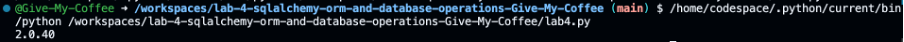

# Лабораторный отчет по SQLAlchemy: ORM и операции с базами данных
---
## Цели лабораторной работы
В ходе лабораторной работы было проведено изучение SQLAlchemy как инструмента объектно-реляционного отображения (ORM) для Python, с акцентом на взаимодействие с базами данных, генерацию запросов, управление сессиями и работу с отношениями.

## Выполненные задачи
- Изучение основных концепций SQLAlchemy и его роли как ORM.
- Установка SQLAlchemy и драйверов баз данных.
- Создание и настройка соединений с базами данных.
- Определение моделей баз данных с использованием декларативного синтаксиса.
- Управление сессиями и выполнение операций CRUD.
- Практика с расширенными запросами и отношениями.
- Исследование жадной загрузки и ее применения.
- Проведение сложных операций с SQLAlchemy.

## Полученные результаты

### Изучение основных концепций SQLAlchemy
На этом этапе мы ознакомились с основными концепциями SQLAlchemy, включая различия между SQLAlchemy Core и ORM, что позволило понять преимущества использования ORM для взаимодействия с реляционными базами данных.

### Установка SQLAlchemy и драйверов баз данных
  
  
На скриншоте показан процесс установки SQLAlchemy и драйвера базы данных с помощью pip, что является первым шагом к работе с ORM.

### Создание соединения с базой данных
  
Скриншот демонстрирует создание соединения с базой данных SQLite с использованием SQLAlchemy. Это позволяет устанавливать связи между приложением и базой данных.

### Определение моделей баз данных
  
На следующем изображении показан процесс определения моделей базы данных с использованием декларативного синтаксиса. Мы создали модели `User` и `Address`, которые помогают организовать данные.

### Управление сессиями и операции CRUD

 
Скриншот демонстрирует выполнение операций CRUD с использованием сессий в SQLAlchemy. Мы создали нового пользователя, обновили его данные и удалили его из базы данных.

### Расширенные запросы

 
На этом изображении показаны примеры расширенных запросов и объединений таблиц. Мы использовали агрегации для анализа данных.

### Исследование жадной загрузки

 
Скриншот демонстрирует применение жадной загрузки для оптимизации запросов и уменьшения числа обращений к базе данных.

### Сложные операции с SQLAlchemy

 
На этом изображении показан пример выполнения сырого SQL-запроса через SQLAlchemy, что позволяет интегрировать сложные запросы.

## Самопроверка
### Вопрос 1: Объясните основные преимущества использования SQLAlchemy как ORM по сравнению с использованием сырых SQL-запросов.
SQLAlchemy как ORM предоставляет абстракцию над базой данных, позволяя разработчикам работать с объектами Python вместо сырых SQL-запросов. Это упрощает код, уменьшает вероятность ошибок и улучшает читаемость. ORM также автоматизирует управление соединениями и транзакциями.

### Вопрос 2: Опишите, как SQLAlchemy управляет сессиями и их значимость в операциях CRUD. 
Сессии в SQLAlchemy управляют состоянием объектов и транзакциями. Они позволяют временно хранить изменения и выполнять их в базе данных по мере необходимости. Сессии обеспечивают контроль за состоянием объектов, что критично для операций CRUD.

### Вопрос 3: Опишите, как отношения (один-ко-многим, многие-ко-многим) моделируются в SQLAlchemy, приведя примеры кода.
Отношения в SQLAlchemy моделируются с помощью функций `relationship` и `ForeignKey`. Например, для отношения один-ко-многим между `User` и `Address`.

### Вопрос 4: Обсудите индексацию в SQLAlchemy, подчеркивая соображения по производительности и практические примеры.
Индексация в SQLAlchemy помогает ускорить выполнение запросов. Создание индекса на колонке, по которой часто выполняются фильтрации или сортировки, может существенно улучшить производительность. 

### Вопрос 5: Объясните концепцию жадной загрузки в SQLAlchemy, включая её влияние на производительность и оптимизацию запросов.
Жадная загрузка позволяет загружать связанные объекты сразу, что уменьшает количество запросов к базе данных и повышает производительность. Это особенно полезно при работе с отношениями, когда необходимо получить связанные данные в одном запросе.
