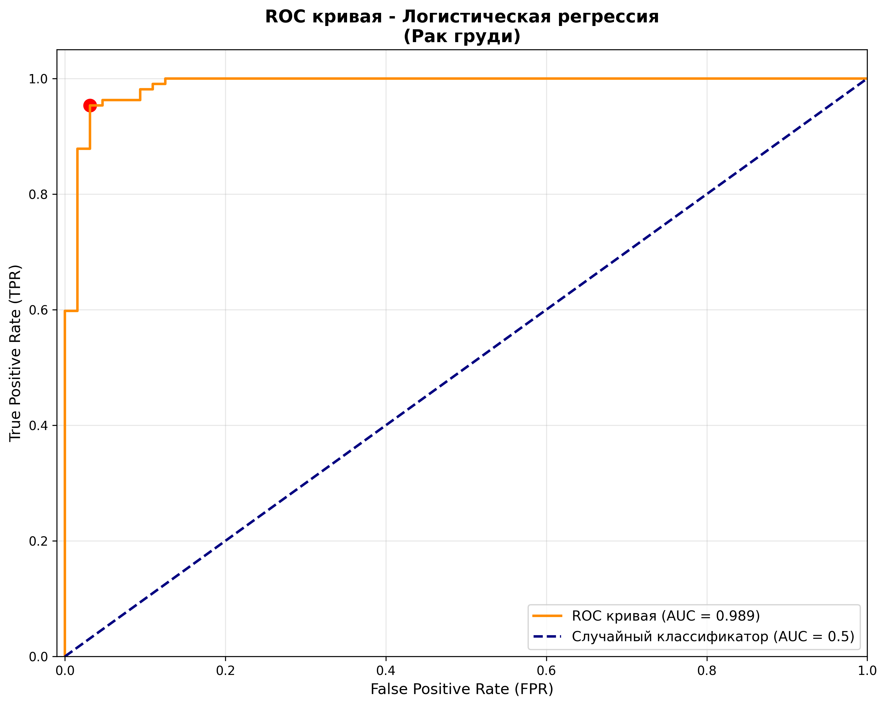
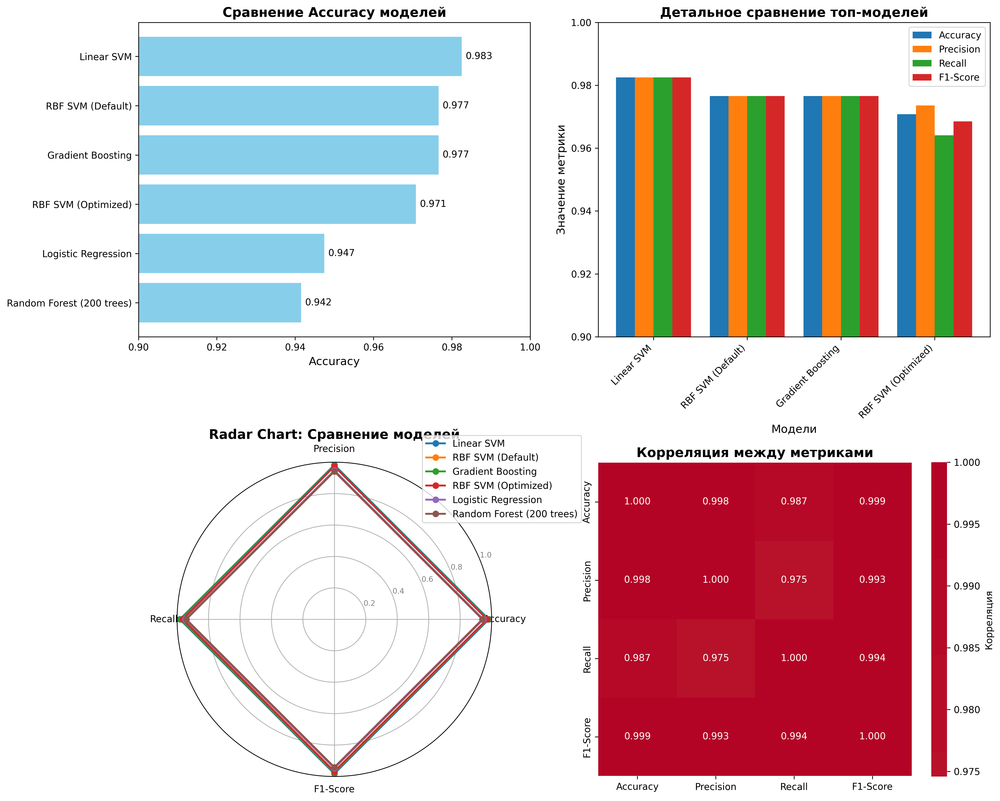

# Лабораторный отчет

## Цель
Понять их теоретическую основу, практическое применение и влияние настройки гиперпараметров.

## Задача 1: Настройка среды и загрузка данных

### Код
```python
from sklearn.datasets import load_breast_cancer
from sklearn.model_selection import train_test_split

data = load_breast_cancer()
X, y = data.data, data.target
X_train, X_test, y_train, y_test = train_test_split(
    X, y, test_size=0.3, random_state=42, stratify=y
)
```

### Результаты
- Обучающая выборка: 398 samples (70%)
- Тестовая выборка: 171 samples (30%)
- Пропорции сохранены: malignant 37.3%, benign 62.7%

### Наблюдения
Данные корректно разделены с сохранением пропорций классов.


## Задача 2: Логистическая регрессия

### Код
```python
from sklearn.linear_model import LogisticRegression

model = LogisticRegression(random_state=42, max_iter=10000)
model.fit(X_train, y_train)
y_pred = model.predict(X_test)
```

### Результаты
- Accuracy: 94.74%
- Confusion Matrix:
  - TN: 62, FP: 2
  - FN: 7, TP: 100
- ROC AUC: 0.9912

### Наблюдения
Хорошая базовая модель с отличной AUC, показывает высокую разделяющую способность.


## Задача 3: Визуализация ROC кривой

### Результаты

- AUC: 0.9912 - отличная разделяющая способность
- Оптимальный порог: 0.428

### Наблюдения
Модель демонстрирует превосходную производительность с очень высокой площадью под кривой.

## Задача 4: Метод опорных векторов (SVM)

### Код
```python
from sklearn.svm import SVC
from sklearn.preprocessing import StandardScaler

# Масштабирование данных
scaler = StandardScaler()
X_train_scaled = scaler.fit_transform(X_train)
X_test_scaled = scaler.transform(X_test)

# Linear SVM
svm_linear = SVC(kernel='linear', random_state=42)
svm_linear.fit(X_train_scaled, y_train)

# RBF SVM с GridSearch
param_grid = {'C': [0.1, 1, 10, 100], 'gamma': [0.001, 0.01, 0.1, 1]}
grid_search = GridSearchCV(SVC(kernel='rbf'), param_grid, cv=5)
grid_search.fit(X_train_scaled, y_train)
```

### Результаты
**Linear SVM:**
- Accuracy: 98.25%
- Лучшая модель

**RBF SVM (по умолчанию):**
- Accuracy: 97.66%

**RBF SVM (оптимизированный):**
- Best params: {'C': 10, 'gamma': 0.001}
- Accuracy: 97.08%

### Наблюдения
- Linear SVM показал наилучший результат
- RBF SVM не улучшил результаты после настройки гиперпараметров
- SVM хорошо подходит для этих данных


## Задача 5: Ансамблевые методы

### Random Forest
```python
from sklearn.ensemble import RandomForestClassifier

rf_model = RandomForestClassifier(n_estimators=200, random_state=42)
rf_model.fit(X_train, y_train)
```

### Gradient Boosting
```python
from sklearn.ensemble import GradientBoostingClassifier

gb_model = GradientBoostingClassifier(n_estimators=200, learning_rate=0.2)
gb_model.fit(X_train, y_train)
```

### Результаты
**Random Forest:**
- Accuracy: 94.15%
- Важные признаки: worst perimeter, worst area, worst concave points

**Gradient Boosting:**
- Accuracy: 97.66%
- Лучшие параметры: n_estimators=200, learning_rate=0.2

### Наблюдения
- Gradient Boosting показал результаты на уровне RBF SVM
- Random Forest хуже по точности, но дает интерпретируемость
- Важные признаки: геометрические параметры опухоли


## Задача 6: Сравнительный анализ моделей

### Результаты
| Модель | Accuracy | Precision | Recall | F1-Score |
|--------|----------|-----------|--------|----------|
| Linear SVM | 98.25% | 98.25% | 98.25% | 98.25% |
| RBF SVM (Default) | 97.66% | 97.66% | 97.66% | 97.66% |
| Gradient Boosting | 97.66% | 97.66% | 97.66% | 97.66% |
| RBF SVM (Optimized) | 97.08% | 97.36% | 96.41% | 96.85% |
| Logistic Regression | 94.74% | 94.74% | 94.74% | 94.74% |
| Random Forest | 94.15% | 94.14% | 94.15% | 94.13% |



### Кросс-валидация лучших моделей
**Linear SVM:**
- Средняя точность: 97.89% ± 0.88%

**Gradient Boosting:**
- Средняя точность: 97.19% ± 1.23%

### Наблюдения
- Linear SVM демонстрирует наилучшую и наиболее стабильную производительность
- Все SVM модели показывают результаты выше 97%
- Ансамблевые методы показывают хорошие результаты, но уступают SVM
- Logistic Regression обеспечивает хороший баланс между точностью и интерпретируемостью


### Заключение
Linear SVM показал наилучшие результаты для данного набора данных, демонстрируя высокую точность, стабильность и эффективность. Рекомендуется для production использования с периодическим мониторингом производительности на новых данных.