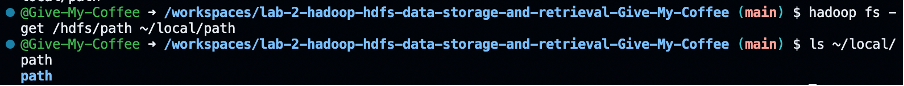
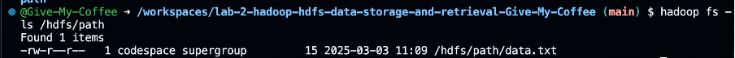
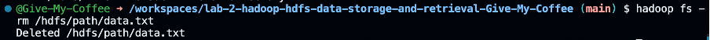
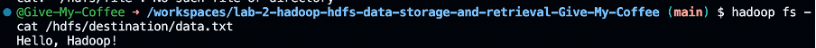
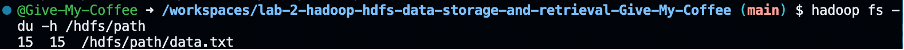
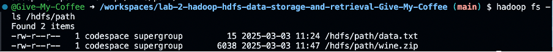
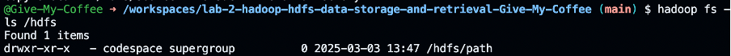

#Лабораторный отчет по HDFS#

##Цели лабораторной работы
В ходе лабораторной работы было проведено ознакомление с основами Hadoop и его распределённой файловой системой HDFS, предназначенной для надежного хранения больших файлов на разных компьютерах в кластере.

##Выполненные задачи
- Создание нового каталога в HDFS.
- Копирование файлов между локальной файловой системой и HDFS.
- Перечисление содержимого каталогов в HDFS.
- Удаление файлов из HDFS.
- Просмотр содержимого файлов в HDFS.
- Перемещение файлов и директорий в HDFS.
- Отображение использования дискового пространства в HDFS.
- Установка разрешений на файлы и каталоги.
- Управление квотами на использование ресурсов.
- Использование функции «Корзина» для восстановления данных.
- Создание снимков данных в HDFS.

##Полученные результаты

###Создание нового каталога

На скриншоте демонстрируется процесс создания нового каталога в HDFS. Пользователь использует команду для иерархической организации данных.

###Копирование файла из локальной файловой системы в HDFS

Следующий скриншот показывает, как файл копируется из локальной файловой системы в HDFS. Это позволяет загрузить данные для дальнейшей обработки.

###Копирование файла из HDFS в локальную файловую систему

На очередном изображении представлена команда для копирования файла из HDFS обратно в локальную файловую систему, что полезно для выгрузки данных.

###Перечисление содержимого каталога в HDFS

Скриншот демонстрирует команду, позволяющую вывести список содержимого каталога в HDFS. Это помогает пользователю ориентироваться в структуре файловой системы.

###Удаление файла из HDFS

На следующем изображении показан процесс удаления файла из HDFS, что освобождает место и помогает управлять данными.

###Копирование файла из HDFS в локальную файловую систему

На очередном изображении представлена команда для копирования файла из HDFS обратно в локальную файловую систему, что полезно для выгрузки данных.

###Копирование файла из локальной файловой системы в HDFS

Следующий скриншот показывает, как файл копируется из локальной файловой системы в HDFS. Это позволяет загрузить данные для дальнейшей обработки.

###Отображение содержимого файла в HDFS

Скриншот иллюстрирует команду для просмотра содержимого файла, хранящегося в HDFS, что позволяет быстро проверить данные без их скачивания.
Перемещение файла или директории в HDFS
Далее показан процесс перемещения файла или директории в HDFS. Это удобно для реорганизации данных.

###Перемещение файла или директории в HDFS

Далее показан процесс перемещения файла или директории в HDFS. Это удобно для реорганизации данных.

###Отображение использования диска

Скриншот демонстрирует команду для отображения текущего использования дискового пространства в HDFS, что важно для мониторинга ресурсов.

###Выбор набора данных из источников

На следующем изображении представлены источники для выбора наборов данных, в частности UCI Machine Learning Repository, что позволяет пользователям загружать данные для анализа.

###Перечисление содержимого каталога в HDFS

Скриншот демонстрирует команду, позволяющую вывести список содержимого каталога в HDFS. Это помогает пользователю ориентироваться в структуре файловой системы.

###Скопируйте данные обратно в локальную файловую систему

На следующем изображении представлена команда для копирования данных обратно из HDFS в локальную файловую систему.

###Установка разрешений

Скриншот показывает процесс установки разрешений на файлы и каталоги в HDFS, что обеспечивает безопасность данных.

###Управление квотами

На этом изображении представлена команда для управления квотами на использование ресурсов, что помогает предотвратить чрезмерное использование хранилища.

###Использование корзины Hadoop

Следующий скриншот демонстрирует функцию «Корзина» в Hadoop, которая защищает данные от случайного удаления и обеспечивает возможность восстановления.

###Создание снимков

В заключительном изображении показан процесс создания снимков данных в HDFS, что позволяет сохранить состояние файловой системы на определённый момент времени для последующего восстановления.

##Самопроверка
###Вопрос 1: Объясните основополагающую роль HDFS в архитектуре Hadoop
HDFS (Hadoop Distributed File System) играет ключевую роль в архитектуре Hadoop, обеспечивая эффективное распределение и хранение больших объемов данных. Он распределяет данные по нескольким узлам для обеспечения масштабируемости и отказоустойчивости. Отказоустойчивость достигается за счет репликации данных между узлами, что позволяет восстановить информацию в случае выхода из строя одного или нескольких узлов. Архитектурное разделение на NameNode и DataNode обеспечивает эффективное управление метаданными и хранение данных, где NameNode отвечает за метаданные и расположение блоков, а DataNode хранит сами данные.

###Вопрос 2: Обсудите три ключевые команды HDFS
Ключевыми командами HDFS являются hadoop fs -mkdir /hdfs/path, которая создает каталоги в HDFS для упорядочивания данных; hadoop fs -put local/path /hdfs/path, позволяющая копировать данные из локальной файловой системы в HDFS, что обеспечивает загрузку данных для обработки; и hadoop fs -ls /hdfs/path, которая выводит список содержимого каталогов в HDFS, помогая пользователю в навигации и поиске данных.

###Вопрос 3: Проанализируйте операционные задачи администрирования Hadoop, связанные с HDFS
Операционные задачи администрирования Hadoop, связанные с HDFS, включают мониторинг работоспособности кластера, что обеспечивает оптимальную производительность и использование ресурсов. Добавление и удаление узлов требует тщательного планирования для поддержания баланса данных и стабильности кластера. Также важны стратегии резервного копирования данных, которые снижают риск потери информации и обеспечивают её целостность в случае сбоев.

###Вопрос 4: Изучите расширенную функцию HDFS
Расширенные функции HDFS включают установку разрешений для файлов и каталогов, что обеспечивает безопасность данных и контроль доступа. Управление квотами помогает распределять ресурсы и предотвращает чрезмерное использование хранилища. Функция «Корзина» в Hadoop защищает данные от случайного удаления, расширяя возможности восстановления информации.

###Вопрос 5: Оцените, как HDFS обеспечивает надёжность и масштабируемость кластеров Hadoop
HDFS обеспечивает надежность и масштабируемость кластеров Hadoop благодаря репликации данных на нескольких узлах, что гарантирует отказоустойчивость и долговечность информации. Конфигурации высокой доступности NameNode предотвращают появление единичных точек отказа при управлении метаданными, что повышает общую надежность системы. Масштабируемость достигается за счет горизонтального масштабирования, позволяющего легко добавлять новые узлы в кластер без значительных изменений в архитектуре.
